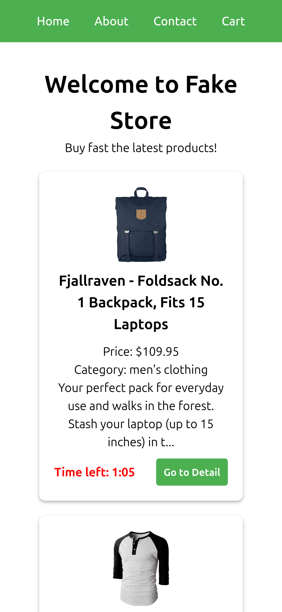

# Make It Real - Aplicación Web con JavaScript Vanilla

This is a solution to the Aplicación Web con JavaScript Vanilla project of the Make It Real course.

## Table of contents

- [Overview](#overview)
  - [The challenge](#the-challenge)
  - [Screenshot](#screenshot)
- [My process](#my-process)
  - [Built with](#built-with)
  - [What I learned](#what-i-learned)
  - [Continued development](#continued-development)
  - [Useful resources](#useful-resources)
- [Author](#author)
- [Acknowledgments](#acknowledgments)

## Overview

### The challenge

Create a web application that consumes the [Fake Store API](https://fakestoreapi.com/) and displays products dynamically. The main goal is to list products on the main page and add a timer for each product, which will disable the purchase button when the time runs out.

Each product must be displayed in a card that includes:

- Title
- Image
- Price
- Description
- Category
- Purchase button (with a timer)

Each product will have a random countdown timer (between 1 and 3 minutes).
Once the time runs out, the "Buy" button should be disabled and non-clickable.

### Screenshot

## Our process

1. Semantic HTML Structure

- Since it's a store, it includes a header and navbar.
- The structure includes main, hero section, and products section.
- A loading message is displayed while the products are loading. If the products fail to load, an error message will be shown.
- Each product is wrapped in an article element (as these product cards are independent).
- Since it's a store, it also has a footer.

2. Adding Static Page Styling

3. Creating Modules:

- main
- fetchProducts
- displayProducts
- productCard
- timer
- disableButton

4. Implementing Functions

5. Finalizing Styles

### Built with

- Semantic HTML5 markup
- CSS custom properties
- Flexbox
- Mobile-first workflow

### Continued development

Learn more about modules in javascript

## Authors

- Juan Alva - [linkedin](https://www.linkedin.com/juan-luis-alva/)
- Enrique Villareal - [github](https://github.com/Enrique-Villarreal-O/)

## Acknowledgments

Thanks to Make It Real for the challenge and to Enrique for implementing the application logic.
